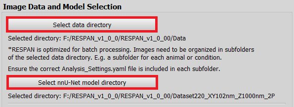
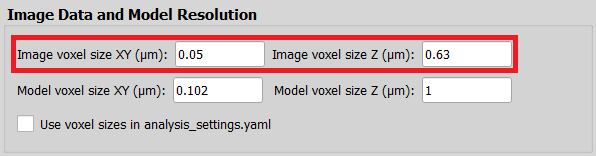
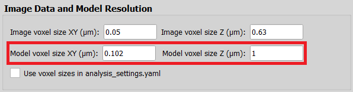
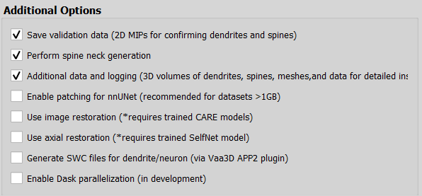

# Установка RESPAN

1.	**Скачайте:** <br>
    a.	Последнюю версию RESPAN для [Windows](https://drive.google.com/file/d/13dLMsuLn4oUEMzvBFJBSYXKujXiBHsLb/view) <br>
    b.	Конфигурационный файл [Analysis_Settings](https://drive.google.com/file/d/1sZoBfViD62nNu-9FYWtYMHtLq6Hwjwhk/edit) <br>
    c.	Претренированную [модель](https://zenodo.org/records/19671965) <br>
2.	**Установите RESPAN:** <br>
    a.	Разархивируйте `RESPAN_v1_0_0.7z` <br>
    b.	Разархивируйте `Model_3_2P_XY102nm_Z1um.7z` <br>
    c.	Запустите RESPAN.exe (первый запуск может занять несколько минут) <br>
3.	**Подготовьте данные, они должны иметь следующую структуру:** <br>
```text
Data
├-> Mouse_2 z-stack 10 neuron 3
│	├-> Mouse_2 z-stack 10 neuron 3 (Day 3).tif
│	├-> Mouse_2 z-stack 10 neuron 3 (Day 6).tif
│	├-> . . .
│	└-> Analysis_Settings.yaml <- Файл с шага 1b*
└── Mouse_8 z-stack 8 neuron 2
   	├-> Mouse_8 z-stack 8 neuron 2 (Day 3).tif
    	├-> . . .   
    	└-> Analysis_Settings.yaml
```
*Необходимо скопировать `Analysis_Settings.yaml` в каждую подпапку. <br>

Альтернативно, используйте функцию respan_prepare (смотри [`example\example_respan`](https://github.com/Negative228/project7_spines/blob/main/example/example_respan.ipynb)) <br>

4.	**Запустите анализ:** <br>
    a.	Выберите папку с данными (например, `Data`) и папку, в которой расположена модель (в нашем случае, `Dataset220_XY102nm_Z1000nm_2P`). <br>
    <p align="left">
        
    </p>
    b.	Установите соответствующие данным значения пространственного разрешения: <br>
    <p align="left">
        
    </p>
    c.	Установите пространственное разрешение модели**: <br>
    <p align="left">
        
    </p>
    **Для указанной модели значения составляют: <br>

 	`Model voxel size XY`: 0.102 <br>
 	`Model voxel size Z`: 1 <br>
    
    d. Убедитесь, что выбраны дополнительные опции, как на изображении ниже: <br>
    <p align="left">
        
    </p>
 
    e.	Нажмите на кнопку **Run**. <br>

5.	**Изучите полученные результаты:** <br>

|Папка|Содержание|
|---|---|
|`Spine_Arrays\`|2D-проекции максимальной интенстивности и 3D z-stack’и шипиков|
|`Tables\`|Таблицы, описывающие результаты анализа: <br> Detected_spines_summary.csv – общее описание всех полученных данных <br> {имя_изображения}_dendrite_summary.csv – описание обнаруженных дендритов <br> {имя_изображения}_dendrite_spines.csv – описание обнаруженных шипиков|
|`Validation_Data\`|Данные для валидации анализа изображение (не используется)|

Для дальнейшего анализа используется функции пакета respy (смотри [`example\example_respan`](https://github.com/Negative228/project7_spines/blob/main/example/example_respan.ipynb)).	
